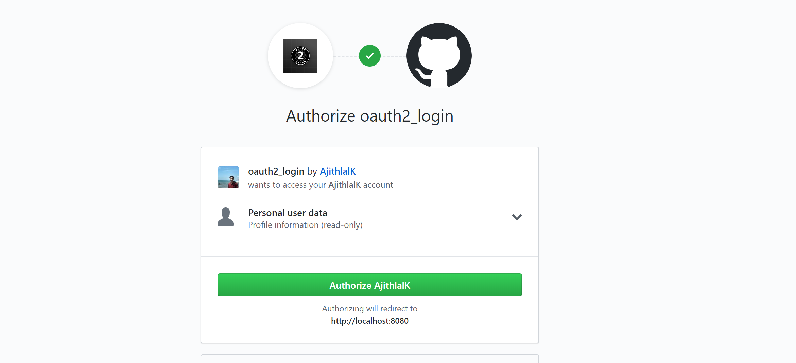

# oauth2_springboot

 oauth2 implementation in spring boot app through gitHub.This repo is single-page apps using Spring Boot and Spring Security on the back end and this add the CSRF token, which you just made available as a cookie from the backend
 
 # Output

 
 
# Author
  Ajithlal K
 
